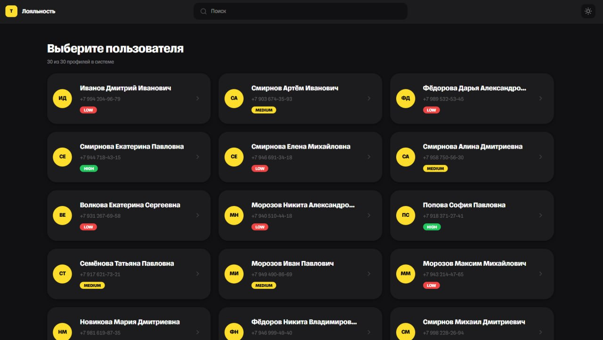
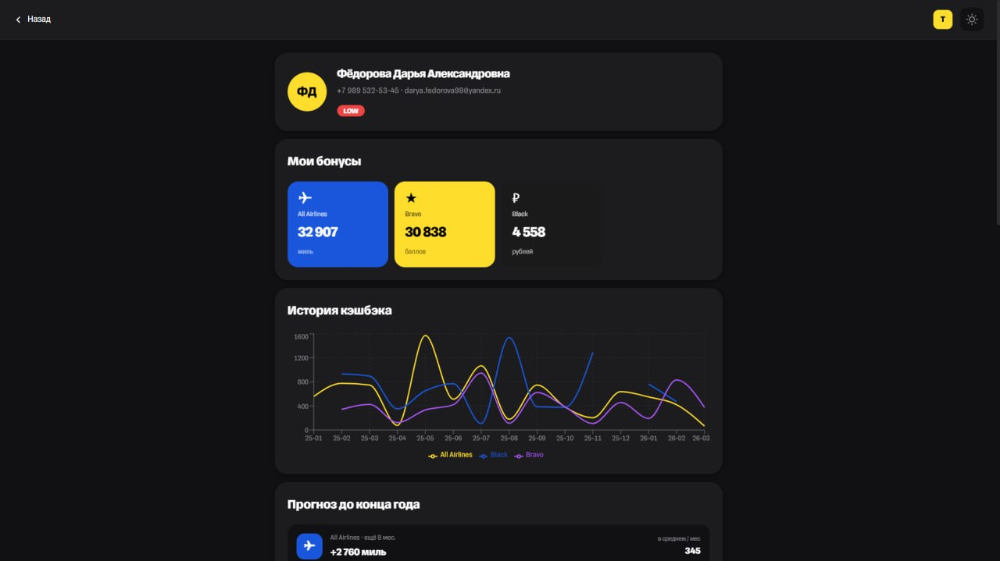
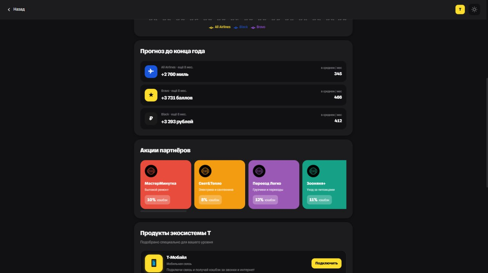
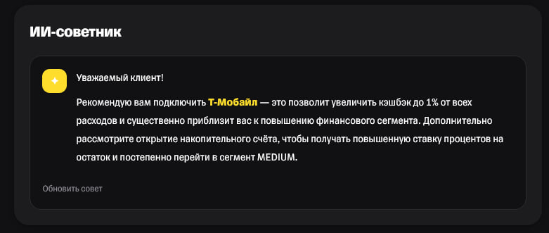
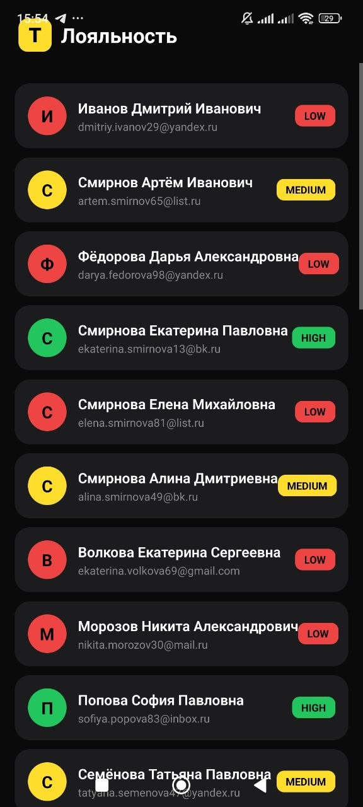
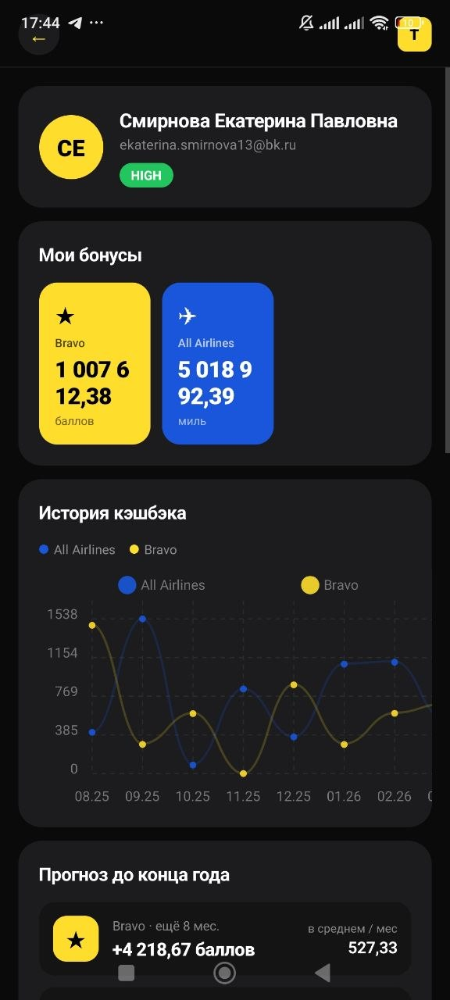
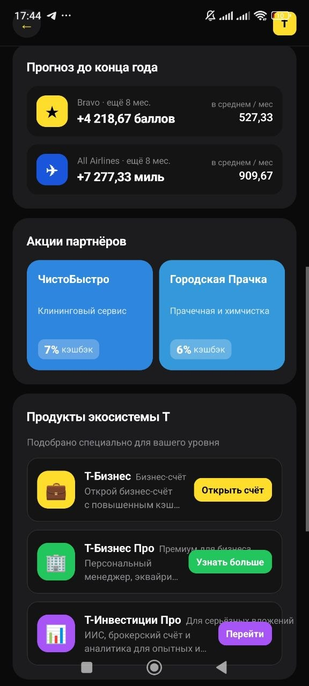

# T-Bank Loyalty — РадиоХак 2026

Единый раздел лояльности для экосистемы Т-Банка. Объединяет весь кэшбэк, акции и бонусы пользователя в одном месте — с аналитикой, прогнозом выгоды, персональными офферами и ИИ-советником.

---

## Ссылки

| | |
|---|---|
| Веб-приложение | http://111.88.144.155:5173/ |
| Backend API / Swagger | http://111.88.144.155:8000/docs |
| APK (Android) | [Скачать с Google Drive](https://drive.google.com/file/d/1W1D53vuyhOTrbVH3U5uSmHBXGbQEepe2/view?usp=sharing) |
| Репозиторий | https://github.com/desper1do/tbank-loyalty |

---

## О проекте

Т-Банк насчитывает 50+ млн клиентов, из которых 16 млн заходят в приложение ежедневно. Кэшбэк, акции и бонусы сейчас разбросаны по разным разделам — пользователь не понимает, сколько реально зарабатывает с банком.

Наше решение — единый экран лояльности, где собрано всё:

- текущие балансы по всем программам лояльности (рубли, мили, баллы Браво)
- история начислений в виде графика
- прогноз кэшбэка до конца года
- персональные офферы партнёров по сегменту пользователя
- кросс-селл продуктов экосистемы Т
- геймификация: стрики и бейджи на реальных данных
- ИИ-советник на базе GigaChat

Пользователи сегментированы по объёму финансов в экосистеме: **LOW / MEDIUM / HIGH**. Контент и предложения персонализированы под каждый сегмент.

---

## Фичи и гипотезы

### 1. Сводка балансов

Три карточки с суммами по каждой программе лояльности: рубли (Black), мили (All Airlines), баллы Браво (Platinum) — первое, что видит пользователь при входе в раздел.

**Гипотеза:** пользователь должен за 2 секунды понять свою суммарную выгоду от банка, без лишних кликов и переходов. Три разные «валюты» кэшбэка представлены раздельно — так легче оценить каждую программу и заметить ту, которой он не пользовался.

---

### 2. График истории кэшбэка

Интерактивный линейный график начислений по месяцам. Каждая программа лояльности отображается отдельной линией своего цвета.

**Гипотеза:** визуальный рост кривой мотивирует продолжать пользоваться картой сильнее, чем сухая цифра баланса. Пользователь видит динамику и может сам найти «просадки» — месяцы, когда он тратил меньше.

---

### 3. Прогноз выгоды

Расчёт ожидаемого кэшбэка до конца текущего года по каждой программе. Прогноз основан на среднем начислении за последние 3 полных месяца, умноженном на оставшиеся месяцы года.

**Гипотеза:** конкретная цифра («вы накопите ещё ~14 000 миль к декабрю») убеждает сильнее абстрактных обещаний о выгоде. Пользователь с мотивацией начинает тратить активнее, чтобы приблизиться к «красивому» порогу.

---

### 4. Офферы партнёров

Горизонтальный скролл карточек с персонализированными акциями: логотип партнёра, процент кэшбэка, краткое описание. Офферы фильтруются по финансовому сегменту пользователя.

**Гипотеза:** нерелевантные предложения раздражают и снижают доверие. Пользователь сегмента LOW не увидит предложения для премиального сегмента, которые ему недоступны, — и наоборот. Горизонтальный скролл выбран намеренно: офферы важны, но не должны перекрывать ключевую информацию о балансах.

---

### 5. Кросс-селл продуктов экосистемы Т

Блок с карточками продуктов Т-Банка, подобранными под сегмент пользователя:
- **LOW** → Т-Мобайл («Подключи связь и получай кэшбэк за звонки»)
- **MEDIUM** → Т-Инвестиции («Инвестируй от 1000₽ и получи бонус»)
- **HIGH** → Т-Бизнес («Открой бизнес-счёт с повышенным кэшбэком»)

**Гипотеза:** пользователь, уже вовлечённый в раздел лояльности, находится в правильном состоянии для знакомства с новым продуктом — он только что убедился, что банк ему выгоден. Сегментация исключает нерелевантные предложения и повышает конверсию перехода.

---

### 6. Геймификация

Стрик (сколько месяцев подряд были начисления) и набор бейджей на основе реальной истории пользователя. Прогресс-бар показывает, сколько осталось до следующего уровня сегмента.

Бейджи: «Первый кэшбэк», «Тысячник», «Путешественник» (All Airlines), «Верный клиент» (стрик ≥ 3 мес.), «Большой игрок» (сегмент HIGH).

**Гипотеза:** визуальный прогресс и достижения формируют привычку регулярно заходить в приложение. Незаработанные бейджи (отображаются серыми) создают цель — пользователь видит, что именно нужно сделать, чтобы их получить.

---

### 7. ИИ-советник

Персональный совет на основе профиля пользователя: сегмент, программы лояльности, балансы, средний кэшбэк. Генерируется через GigaChat (Сбер). Загружается по кнопке и кэшируется — повторного запроса при пролистывании не происходит.

**Гипотеза:** персонализированный совет («у вас 89 000 миль — хватит на перелёт Москва–Сочи туда-обратно») создаёт ощущение ценности и подталкивает к конкретному действию. Конкретика работает лучше обобщённых рекомендаций.

---

### 8. Мобильное приложение (React Native / Expo)

Нативное мобильное приложение на Expo с двумя экранами: выбор пользователя и раздел лояльности. Содержит балансы, офферы и геймификацию. Использует тот же backend API.

**Гипотеза:** лояльность — мобильный сценарий по природе. Пользователь проверяет кэшбэк «на ходу», а не за компьютером. Мобильное приложение закрывает этот сценарий без потери функциональности.

---

## Скриншоты

### Веб-приложение

**Выбор пользователя**


**Балансы + график истории кэшбэка**


**Прогноз выгоды до конца года**


**ИИ-советник с персональным ответом**


### Мобильное приложение

**Выбор пользователя**


**Экран лояльности: балансы**


**Прогноз и офферы**


---

## API

| Метод | Путь | Описание |
|---|---|---|
| GET | `/` | Health check |
| GET | `/users/` | Список всех пользователей (30 шт.) |
| GET | `/users/{id}` | Профиль одного пользователя |
| GET | `/users/{id}/balances` | Балансы по всем программам лояльности |
| GET | `/users/{id}/history` | История начислений, агрегированная по месяцам |
| GET | `/users/{id}/offers` | Офферы партнёров, отфильтрованные по сегменту |
| GET | `/users/{id}/forecast` | Прогноз кэшбэка до конца текущего года |
| GET | `/users/{id}/gamification` | Стрик, бейджи, прогресс до следующего уровня |
| POST | `/users/{id}/ai-advice` | Персональный совет от GigaChat |
| GET | `/offers/` | Все офферы без фильтрации |
| GET | `/history/` | Вся история начислений |
| GET | `/loyalty-programs/` | Справочник программ лояльности |

Полная документация с примерами запросов и ответов: http://111.88.144.155:8000/docs

---

## Стек технологий

| Слой | Технология |
|---|---|
| Backend | Python 3.11, FastAPI, pandas |
| Frontend | React 18, TypeScript, Tailwind CSS, Recharts |
| Mobile | React Native, Expo |
| ИИ | GigaChat API (Сбер) |
| Контейнеризация | Docker, Docker Compose |
| CI/CD | GitHub Actions |
| Деплой | VPS (backend :8000, frontend :5173) |

**Данные:** 5 CSV-файлов, загружаемых в память при старте — 30 пользователей, 3 программы лояльности, 1711 транзакций за январь 2025 — март 2026, 40 офферов партнёров.

---

## Запуск локально

### Через Docker (рекомендуется)

```bash
git clone https://github.com/desper1do/tbank-loyalty.git
cd tbank-loyalty

# Создать файл с переменными окружения (обязательно)
cp backend/.env.example backend/.env
# Вставить в backend/.env ключ: GIGACHAT_CREDENTIALS=<ваш_ключ>

docker-compose up --build
```

После запуска:
- Фронтенд: http://localhost:5173
- Swagger / Backend API: http://localhost:8000/docs

> **Важно:** без заполненного `backend/.env` с ключом `GIGACHAT_CREDENTIALS` ИИ-советник не будет работать. За ключом писать в Telegram: [@desper1do](https://t.me/desper1do)

### Вручную

```bash
# Backend
cd backend
pip install -r requirements.txt
uvicorn app.main:app --reload   # :8000

# Frontend (в отдельном терминале)
cd frontend
npm install
npm run dev   # :5173

# Mobile (в отдельном терминале)
cd mobile
npm install
npm run start   # Expo Dev Server
```

### Тесты

```bash
cd backend
pytest tests/ -v
```

---

## Команда

| Участник | Роль |
|---|---|
| Данила | Тимлид, архитектура, ИИ-фича, прогноз, деплой |
| Ника | Весь фронтенд (React) |
| Данил | Весь бэкенд (FastAPI) |
| Даша | Геймификация, мобильное приложение |
| Влад | Кросс-селл виджет, дополнительные тесты, документация кода |

---

## Контакт

Telegram: [@desper1do](https://t.me/desper1do)
